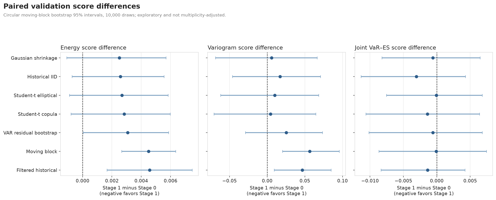

# CrisisForge

**Regime-aware market simulation for tail-risk decisions**

I built CrisisForge to test a question that generative-finance projects often
skip: does a more realistic scenario generator actually improve portfolio risk
decisions?

The project combines a switching factor model, a small one-shot diffusion pilot,
asset-level risk reconstruction, CVaR and Wasserstein-DRO decisions, and a
semi-synthetic counterfactual experiment. The honest result is negative: on the
current validation sample, simple rolling historical baselines were stronger than
the complex generator on several important distribution and portfolio metrics.

All results reported here are validation results. The post-2019 holdout has not
been used for model selection or performance claims.



## What I found

- **The simple baselines won.** Filtered historical simulation had the best
  validation energy score (0.08974), while a 20-observation moving block had the
  best variogram score (0.53223).
- **The switching factor model did not improve the central distribution fit.**
  Its paired energy-score difference versus the moving-block baseline was
  +0.00450, with a 95% interval of [0.00266, 0.00635]. Lower is better.
- **Tail-score differences were inconclusive.** The paired joint VaR-ES intervals
  crossed zero, so the validation evidence does not support a tail-risk advantage.
- **The diffusion model is only an engineering pilot.** It was evaluated at four
  forecast origins—enough to test the one-shot pipeline and leakage controls, but
  not enough to rank it against the other models.
- **Better-looking scenarios did not produce better portfolio decisions.**
  Historical CVaR had lower observed validation Expected Shortfall and maximum
  drawdown than the Stage 1 scenario portfolio.
- **The counterfactual code works when the structural model is known, but it is
  sensitive to misspecification.** That extension is a software validation
  experiment, not evidence about real-world policy effects.

The full results, assumptions, and uncertainty analysis are in the
[research report](reports/crisisforge_research_report.pdf).

## How it works

1. Download and align public market and macro-financial data without using future
   information.
2. Compare conventional rolling scenario generators, including historical,
   filtered historical, block-bootstrap, multivariate Student-t, copula, and
   VAR-based baselines.
3. Estimate a regime-switching dynamic factor model and soft state probabilities.
4. Generate complete future factor paths with a one-shot temporal diffusion model.
5. Map factors back to asset returns through

   $$
   r_t = B(z_t)f_t + D(z_t)\epsilon_t
   $$

6. Evaluate asset-level VaR, Expected Shortfall, co-crash probabilities, CVaR
   portfolios, and Wasserstein-DRO sensitivity.
7. Test structural interventions separately in a semi-synthetic market where the
   counterfactual truth is known.

The main implementation lives in [`src/crisisforge`](src/crisisforge).

## Data

The public-data version uses:

- Kenneth French's value-weighted 12-industry portfolios;
- official U.S. Treasury daily par yields, converted into transparent bond-return
  proxies;
- the New York Fed effective federal funds rate;
- OFR Financial Stress Index components as validation labels; and
- backward-looking risk features derived from the return panel.

The aligned sample covers 2000-07-05 through 2026-05-29. It contains 15 asset
return targets and 10 context variables.

Downloaded and row-level derived data are intentionally not stored in Git. The
pipeline retrieves them from the original publishers, and synthetic fixtures are
used for tests. See [NOTICE.md](NOTICE.md) and the
[data dictionary](docs/data_dictionary.md) for source and licensing details.

## Quick start

Requirements: Python 3.11 and [uv](https://docs.astral.sh/uv/).

```bash
uv sync --extra dev --extra models --extra reporting
uv run pytest
uv run crisisforge-phase0 --refresh
```

The remaining model and evaluation entry points are listed in
[`pyproject.toml`](pyproject.toml); each command also supports `--help`.

## Repository layout

```text
configs/                 model and evaluation settings
data/                    local download and processed-data locations
docs/                    methods, data definitions, and literature review
reports/                 final report and research figures
scripts/                 data and report entry points
slides/                  research presentation
src/crisisforge/         Python package
tests/                   unit and integration tests
```

## Project material

- [Research report (PDF)](reports/crisisforge_research_report.pdf)
- [Research report (Markdown)](reports/crisisforge_research_report.md)
- [Mathematical formulation](docs/mathematical_formulation.md)
- [Data dictionary](docs/data_dictionary.md)
- [Literature review](docs/literature_review.md)
- [Research presentation](slides/crisisforge_research_presentation.pptx)

## Limitations

- The current evidence is validation-only; it is not a claim about the untouched
  holdout period.
- Stage 1 uses MAP/regularized estimation rather than a full Bayesian posterior.
- The diffusion experiment is deliberately small and does not establish model
  superiority.
- The public panel is retrospective and is not an investable total-return universe
  or live trading feed.
- The counterfactual extension is validated on a known semi-synthetic system and
  does not identify causal effects in observed markets.

Built by [康智雄](https://github.com/davie0624).

The original CrisisForge software and documentation are released under the
[MIT License](LICENSE). Third-party data remain subject to their respective terms.
