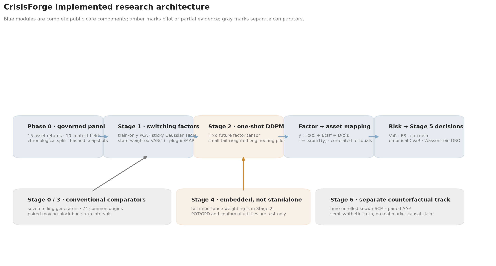
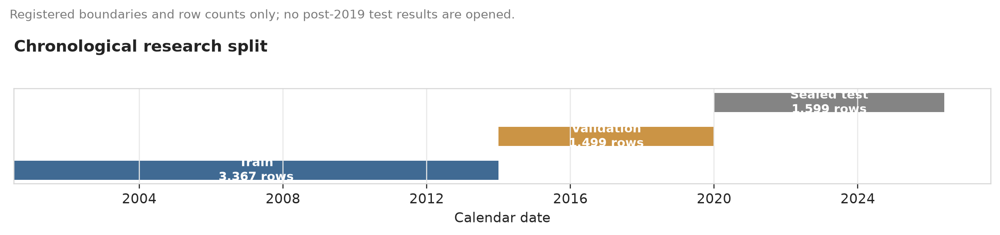
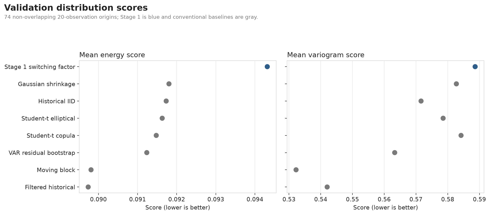
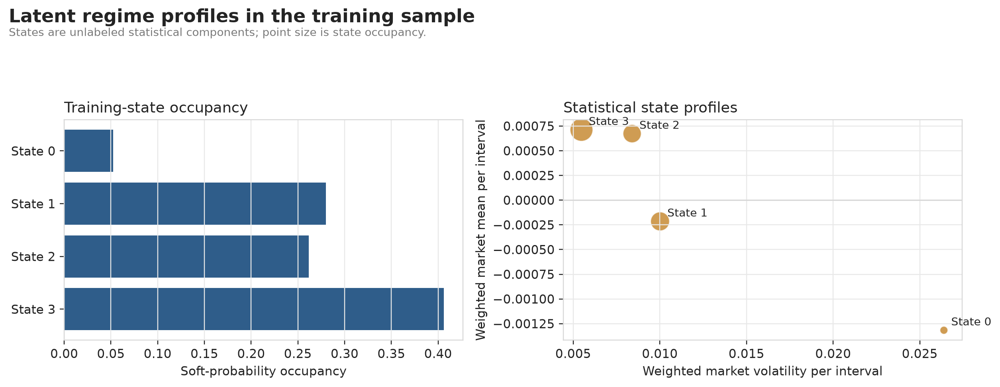
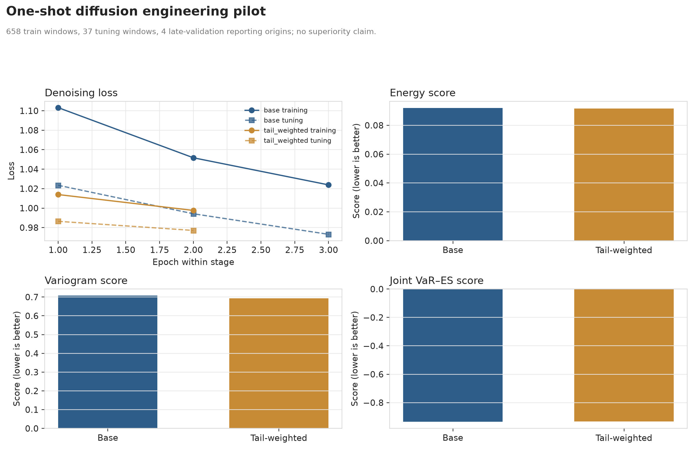
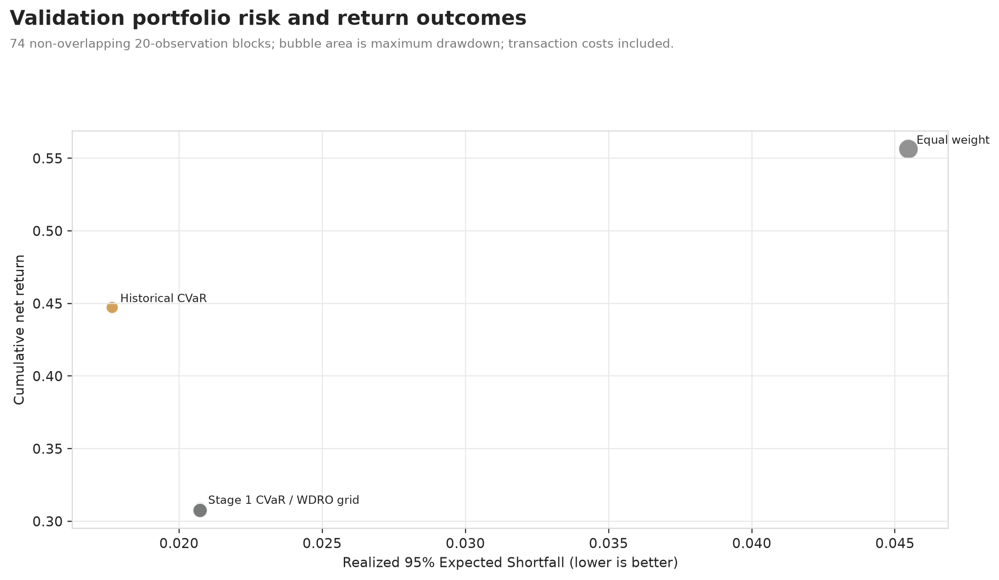
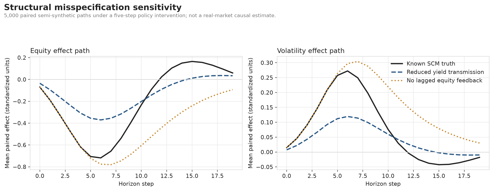

# CrisisForge

## Decision-Focused Market Simulation under Regime Shifts

### Factor-Structured Temporal Diffusion, Asset-Level Tail Risk, and Robust Portfolio Control

**Technical research report · Public-core validation release v0.3.0 ·
28 July 2026**

## Technical summary

CrisisForge is a reproducible research system for testing whether structured and
generative financial scenarios improve multi-asset tail-risk measurement and
portfolio decisions. The implemented system combines a train-only factor
representation, a sticky Gaussian hidden Markov model, regime-weighted factor
dynamics, a stochastic factor-to-asset map, a one-shot temporal diffusion pilot,
asset-level VaR/Expected Shortfall/co-crash metrics, empirical CVaR, a tractable
1-Wasserstein robust-CVaR decision layer, and a separate semi-synthetic structural
counterfactual experiment.

The main result is not that generative AI wins. Strong conventional models remain
hard to beat. On 74 common validation origins, the Stage 1 switching-factor model
has worse energy and variogram scores than leading historical and block-bootstrap
baselines. Its joint VaR–ES point score is close to the best conventional result,
but every paired joint VaR–ES interval includes zero. The Stage 2 diffusion run is
an engineering pilot with four reporting origins and cannot establish superiority.
Historical empirical CVaR has lower realized validation ES, drawdown, turnover,
and transaction cost than Stage 1 scenario CVaR; the registered Wasserstein radii
barely change allocations. A known-SCM counterfactual engine recovers oracle paths
to numerical precision but deteriorates substantially under structural
misspecification.

These findings matter because they reject a common implicit premise: statistical
or architectural sophistication does not automatically improve risk decisions.
The public-core contribution is an auditable framework, a sealed test contract,
and a retained set of negative results that define the next valid experiments.

No reported result uses the post-2019 test set. The study does not establish
investability, a live-trading edge, real-market causal identification, or an AI
system capable of predicting the next crisis.

## The implemented system is broad, but its evidence levels differ

The core path moves from governed public data to latent factors and states, then
to asset scenarios, risk measures, and decisions. Conventional generators provide
the comparison set. Tail weighting is integrated only in the small diffusion
pilot. The causal track is deliberately separate because it relies on known
semi-synthetic structural equations.

The diagram should be read as an evidence map. Blue boxes are completed
public-core components; amber identifies pilot or partial evidence; gray identifies
comparators or a separate semi-synthetic validation track. “Switching factors”
means a multi-stage PCA–HMM–VAR estimator with plug-in parameters. It is not a
joint Bayesian posterior. The factor-to-asset equation is genuinely implemented,
including correlated idiosyncratic residuals, but its parameters are fixed after
training rather than drawn from a posterior.

## The research frontier supports the components, not a presumption of success

The design is anchored in several distinct primary literatures. Hamilton's
[Markov-switching model](https://www.jstor.org/stable/1912559) and Kim's
[switching state-space filtering](https://www.sciencedirect.com/science/article/pii/0304407694900361)
establish latent-state and filtering foundations. Recent peer-reviewed work by
[Urga and Wang](https://openaccess.city.ac.uk/id/eprint/32040/) and
[Barigozzi and Massacci](https://cris.unibo.it/handle/11585/1000607) develops
high-dimensional or large-panel regime-switching factor methods.

For one-shot generation, [TimeDiff](https://proceedings.mlr.press/v202/shen23d.html)
provides an archival precedent for non-autoregressive multi-step diffusion, while
[FTS-Diffusion](https://proceedings.iclr.cc/paper_files/paper/2024/hash/f90fc76b199fe6b0ec2a51aaf72c3277-Abstract-Conference.html)
addresses financial time-series structure. Finance-specific factor diffusion
remains frontier evidence: the closest direct factor-structured paper,
[Chen et al.](https://arxiv.org/abs/2504.06566), is a preprint and is used only to
motivate a falsifiable hypothesis. Tail-focused generation has a peer-reviewed
comparator in [Tail-GAN](https://pubsonline.informs.org/doi/10.1287/mnsc.2023.00936);
conditional EVT is grounded in
[McNeil and Frey](https://www.sciencedirect.com/science/article/abs/pii/S0927539800000128).

The decision layer follows the tractability results for
[Wasserstein DRO](https://link.springer.com/article/10.1007/s10107-017-1172-1)
and the distinction between prediction quality and downstream decision loss in
[decision-focused learning](https://pubsonline.informs.org/doi/10.1287/mnsc.2020.3922).
The counterfactual track is aligned with accepted time-series intervention work
such as [DoFlow](https://iclr.cc/virtual/2026/poster/10011565) and
[DiffCATS](https://openreview.net/forum?id=FwC6CyaHop), but those sources do not
identify monetary-policy effects in observational financial data.

The full status ledger, publication metadata, and claim-to-source limits are in
`docs/literature_review.md`. Every 2025–2026 manuscript without an archival record
is labeled as a preprint or working paper.

## Data governance prevents the test set from becoming a hidden tuning resource

The public matrix has 6,465 complete common-endpoint observations, 15 asset-return
targets, and ten context variables. The targets comprise 12 value-weighted
Kenneth French industry research portfolios and three duration-convexity Treasury
return proxies derived from official par yields. The context contains Treasury
yield levels and slope, New York Fed EFFR, and five backward-looking
industry-return features.

The assets are method-development proxies. French industry portfolios are
retrospective research constructs, not ETFs. Treasury targets are approximations,
not observed total-return indices. The panel is suitable for falsifying scenario
methods; it is not sufficient for tradeability or execution claims.

| Property | Registered public core |
|---|---:|
| Complete model rows | 6,465 |
| Asset targets | 15 |
| Context features | 10 |
| First model date | 5 July 2000 |
| Last model date | 29 May 2026 |
| Phase 0 quality gates | 23/23 passed |
| Formal warning | French source ends 60 days before requested endpoint |

The split is chronological: 3,367 training rows through 2013, 1,499 validation
rows through 2019, and 1,599 sealed test rows from 2020. Experiment runners scan
the processed Parquet matrix only through the registered validation boundary.

The gray bar is a governance commitment rather than reported evidence. Its dates
and row count are registered, but no post-2019 model score or portfolio result
appears in this report. Phase 0 constructs and quality-checks those rows; “sealed”
means they are governed-excluded from estimator fitting, checkpoint selection,
model scoring, and portfolio decisions. Using that span for model evaluation
requires a new signed release decision; it cannot be used to improve the current
model family and still be called a test.

The Phase 0 manifest contains 106 governed file records and has SHA-256
`f051ec35236a481858b67c5b1e7136f1698036832f427efba521dbf3fcd36d70`.
Stages 0–5 bind that exact snapshot and clean experimental commit
`b6891133bdb6b96e1e23c6bea3bd033ea9685c7c`; Stage 6 v2 is bound to its
separately recorded clean implementation commit
`23a4c9ad20683e5e94f7154472073a96d18f90be`.

## Conventional time-dependence baselines lead the structured model

Stage 0 evaluates seven conventional generators on 74 non-overlapping
\(H=20\) validation origins, using 1,000 scenarios per origin. The model set
includes historical IID, a moving-block bootstrap, filtered historical simulation
with EWMA volatility, Gaussian shrinkage, multivariate Student-\(t\), a
Student-\(t\) copula, and VAR residual bootstrap.

Stage 1 estimates four PCA factors, a four-state sticky Gaussian HMM, weighted
state-specific VAR(1) dynamics, and a regime-weighted Gaussian observation map.
The four factors explain 85.995% of standardized training log-return
observation-space variance. The HMM converges after 37 iterations from the selected
one of 12 initializations. Its smallest state has 5.23% soft occupancy, above the
registered 3% diagnostic warning threshold; all state-specific VAR dynamics are
stable. The separate 0.1% HMM minimum-state-weight setting is an estimation
safeguard, not a reported occupancy target.

Energy and variogram scores use the 15-asset geometrically compounded \(H=20\)
return vector. VaR, ES, joint VaR–ES, and violation rates use a frozen
equal-weight portfolio with \(w_i=1/15\).

| Model | Energy ↓ | Variogram ↓ | Joint VaR–ES ↓ | VaR violation rate |
|---|---:|---:|---:|---:|
| Filtered historical EWMA | **0.089739** | 0.542024 | -0.947758 | 2.70% |
| Moving block | 0.089811 | **0.532226** | -0.949032 | **5.41%** |
| VAR residual bootstrap | 0.091236 | 0.563301 | -0.948535 | 2.70% |
| Student-\(t\) copula | 0.091478 | 0.584204 | -0.947724 | 2.70% |
| Student-\(t\) elliptical | 0.091630 | 0.578555 | -0.949064 | 4.05% |
| Historical IID | 0.091732 | 0.571600 | -0.946065 | 2.70% |
| Gaussian shrinkage | 0.091803 | 0.582730 | -0.948546 | 4.05% |
| Stage 1 switching factor | 0.094315 | 0.588639 | **-0.949124** | 1.35% |

Lower scores are better. Stage 1 is visibly behind every conventional model on
energy score and behind the leading block/historical methods on variogram score.
Its joint VaR–ES point estimate is marginally lower than the best Stage 0 value,
but the difference is \(0.000060\), too small to interpret without paired
uncertainty. Its one VaR breach in 74 blocks indicates a conservative forecast;
it does not establish improved calibration. Bold marks the lowest point estimate
in each score column; in the VaR-violation column it marks the rate closest to the
nominal 5%, not the numerically smallest rate.

No baseline wins every metric. Filtered historical simulation has the lowest
energy score; moving blocks have the lowest variogram score, which emphasizes
pairwise return-difference structure, and give the closest 5% VaR coverage; and
the Student-\(t\) elliptical model has the leading Stage 0 joint tail score. The
dispersion of winners is itself evidence against choosing a model from one
aggregate metric.

## Paired uncertainty shows no reliable Stage 1 advantage

Stage 3 compares Stage 1 and each Stage 0 generator at identical origins. A
circular moving-block bootstrap with block length four and 10,000 draws preserves
local dependence among ordered origin differences. Intervals are exploratory and
not multiplicity-adjusted.

For energy score, the Stage 1 difference is \(+0.00458\) versus filtered
historical simulation and \(+0.00450\) versus moving block; both 95% intervals
exclude zero. For variogram score, the differences are \(+0.0466\) and
\(+0.0564\), again with intervals above zero. Positive differences favor Stage 0.
All seven joint VaR–ES intervals cross zero.

Twenty-one intervals are reported across three metrics and seven baselines. None
clearly favors Stage 1; five exclude zero in the direction unfavorable to Stage 1.
This is descriptive inferential evidence, not a causal treatment effect of model
class. Stage 0 refits a rolling 1,500-row window at every origin, whereas Stage 1
freezes parameters at the end of training and updates only filtered state beliefs.
The comparison therefore mixes architecture and update policy.

## The latent states are statistically distinct, not automatically economic labels

The four HMM states differ in mean, volatility, persistence, and occupancy. State
0 has the lowest weighted market mean and highest weighted volatility; state 3
has the highest mean, lowest volatility, and largest occupancy. State 0 also
receives high ex-post probability during parts of 2008. These observations support
an ex-post “high-volatility/negative-mean profile,” but do not justify naming the
component a structural crisis regime.

The distinction is important. State numbers are statistical labels chosen for
reproducibility, not observed market types. The current HMM has Gaussian factor
emissions and homogeneous transitions. It does not contain macro-dependent
transition probabilities or a Bayesian parameter posterior. Treating a state as
an economic cause would exceed what the estimator identifies.

## The factor-to-asset map closes the financial modeling loop

The scenario generator operates in four-dimensional factor space, while VaR, ES,
co-crash, and portfolio optimization require 15 asset-level simple returns.
CrisisForge therefore estimates a state-specific observation equation in
log-return space:

\[
y_t=\log(1+r_t)
=\alpha_{z_t}+B_{z_t}f_t+D_{z_t}\epsilon_t,
\qquad
\operatorname{Cov}(D_z\epsilon_t)=D_zR_zD_z,
\qquad
r_t=\operatorname{expm1}(y_t).
\]

In the implementation, each state uses a weighted ridge map and a shrunk Gaussian
residual covariance. Scenario generation draws a complete future state path,
applies the corresponding \(B_z\), adds a correlated residual draw in \(y\)-space,
and converts the result back to simple returns with \(\operatorname{expm1}\). It
never probability-averages state-specific loading or Cholesky matrices. This
retains modeled asset-specific residual variation and residual dependence, avoiding
the false conclusion that every asset is a deterministic function of four common
factors.

This layer is structurally necessary but not yet fully ablated. A fixed-map
comparator, Student-\(t\) residuals, and parameter-posterior propagation remain
future experiments.

## The diffusion run validates engineering, not model superiority

Stage 2 learns a complete \(20\times4\) future factor tensor in one reverse
diffusion process. Context consists of a 60-observation factor/macro history and
the origin's filtered state probabilities. The public pilot uses 658 train
windows, 37 tuning windows, 12 diffusion steps, 64 scenarios per origin, three
base epochs, two tail-weighted fine-tuning epochs, and only four late-validation
reporting origins.

| Pilot variant | Energy ↓ | Variogram ↓ | Joint VaR–ES ↓ | VaR breaches |
|---|---:|---:|---:|---:|
| Base DDPM | 0.092049 | 0.707209 | **-0.934902** | 0/4 |
| Tail-weighted DDPM | **0.091680** | **0.693524** | -0.933368 | 0/4 |

Tail weighting improves energy by 0.40% and variogram by 1.94%, but worsens the
joint VaR–ES score by 0.00153. This is a metric trade-off between multivariate
distribution scores and the joint VaR–ES score, not evidence of calibrated tail
improvement. Four origins cannot support confidence intervals, coverage claims,
or a ranking against 74-origin models. Future HMM paths are also drawn
independently of generated factor paths conditional on the same origin belief, so
their joint dynamic consistency is not guaranteed.

The valid conclusion is narrow: the Python implementation can form chronological
windows, standardize train-only inputs, train and checkpoint a one-shot DDPM,
perform a tail-weighted fine-tune, generate factor tensors, reconstruct
asset-level scenarios, and retain a complete audit trail. POT/GPD and rolling
conformal utilities exist and are tested but were not integrated into this run.

## Co-crash validation is event-limited

Co-crash probability is defined from training-only asset thresholds and the
fraction of assets simultaneously breaching them over an \(H=20\) block. At every
evaluated origin—74 Stage 0/Stage 1 origins and four Stage 2 origins—the realized
validation co-crash label is zero; generated scenario sets may still assign
nonzero co-crash probabilities.

This means the Brier scores mainly reward forecasting probabilities near zero.
They do not establish the ability to distinguish an actual co-crash. A meaningful
study needs either more evaluation origins, a less extreme preregistered event
definition, a longer licensed history, or a separate stress-evaluation design.
The event definition cannot be changed after inspecting results and still be
treated as confirmatory.

## Complex scenarios did not produce lower observed decision risk

Stage 5 converts scenario paths to geometrically compounded \(H=20\) asset
returns, then solves long-only, fully invested 95% CVaR problems with a 20% asset
cap, 40% L1 turnover cap, and 10-basis-point linear transaction-cost rate. Four
Wasserstein radii are reported as separate sensitivities, not tuned winners.

| Decision rule | Cumulative net return | Realized ES ↓ | Maximum drawdown ↓ | Mean L1 turnover |
|---|---:|---:|---:|---:|
| Equal weight | **0.5564** | 0.04547 | 0.08769 | **0.01956** |
| Historical empirical CVaR | 0.4473 | **0.01767** | **0.03411** | 0.04724 |
| Stage 1 scenario CVaR | 0.3083 | 0.02074 | 0.04782 | 0.16885 |
| Stage 1 WDRO grid | 0.3074–0.3083 | 0.02074 | 0.04782 | 0.16863–0.16885 |

Equal weight has the highest net return but the weakest risk protection.
Historical CVaR has the lowest observed validation ES and drawdown among the
tested rules. Relative to Stage 1 scenario CVaR, it also has 13.9 percentage
points more cumulative net return and much lower turnover. Stage 1 produces a
lower realized VaR, but its ES is higher, indicating larger observed conditional
tail losses beyond the threshold. These rankings are descriptive: they use 74
non-overlapping block outcomes, and no paired sampling interval or
multiplicity-adjusted test was computed.

The WDRO radii \(0.0001\) and \(0.00025\) return the same solution as empirical
Stage 1 CVaR; \(0.0005\) and \(0.001\) produce only tiny changes and no ES or
drawdown improvement. One plausible explanation is that the 20% position cap
already constrains the \(\ell_\infty\) norm penalized by the L1-ground-cost
Wasserstein dual. This explanation is interpretive rather than separately
identified. What the evidence establishes is a locally flat validation
sensitivity, not a robust-decision advantage.

## The counterfactual engine is correct under truth and fragile under misspecification

Stage 6 uses a known, time-unrolled, regime-switching SCM with within-period order
policy → yield → liquidity → credit → equity → volatility and lagged
equity-to-policy feedback. A five-step policy intervention is applied to 5,000
paired \(H=20\) paths with shared exogenous noise.

Abduction–action–prediction recovers the oracle counterfactual with maximum error
\(4.08\times10^{-17}\). This verifies the implementation in a model where every
structural equation and innovation is known. Two deliberately incorrect models
then alter the yield-transmission coefficient or remove lagged equity feedback.

| Misspecification | Equity path RMSE | Equity tail-effect error | Volatility path RMSE | Volatility tail-effect error |
|---|---:|---:|---:|---:|
| Reduced yield transmission | 0.1885 | 0.6019 | 0.0731 | 0.5466 |
| No lagged equity feedback | 0.2782 | 3.2142 | 0.0931 | 3.4354 |

For outcome \(j\), Stage 6 defines path loss as
\(L_j=s_j\sum_{h=1}^{20}X_{j,h}\), with
\(s_{\mathrm{equity}}=-1\) and \(s_{\mathrm{volatility}}=+1\). The tail effect is
\(\operatorname{ES}_{0.95}(L_j^{\mathrm{treated}})
-\operatorname{ES}_{0.95}(L_j^{\mathrm{reference}})\). Lower cumulative equity
outcomes are therefore losses, while higher cumulative volatility is a stress
loss. “Tail-effect error” is the absolute error in that 20-step path-loss ES
effect. Path RMSE compares the estimated and known mean intervention-effect paths.

The misspecified path RMSE range, 0.0731–0.2782 standardized units, shows that
counterfactual outputs depend materially on structural assumptions even when the
numerical AAP machinery is correct. The controlled direct effect is zero because
the registered mediator schedule blocks all policy-to-outcome paths by design.

Nothing in this experiment identifies the effect of a Federal Reserve action in
observed markets. A real-data causal claim would require a separately registered
treatment, identification strategy, support analysis, and external validity
argument.

## What the experiments establish—and what they do not

### Established on the validation evidence

- The public data pipeline is reproducible, availability-aware, and bound to a
  fixed content-addressed snapshot.
- The switching-factor and stochastic observation pipeline produces finite,
  schema-valid asset-level scenarios with stable fitted state-specific dynamics.
- Strong historical and block-bootstrap methods lead the structured model on
  several joint-distribution metrics.
- The one-shot diffusion path runs end to end and displays a visible trade-off
  between multivariate distribution scores and the joint VaR–ES score.
- Generator complexity does not automatically improve realized CVaR decisions.
- The known-SCM counterfactual implementation is numerically correct and
  structurally sensitive.
- Negative results, failures, configurations, and receipts are retained.

### Not established

- Any superiority on the sealed test set.
- Full Bayesian posterior uncertainty or parameter propagation.
- Tail calibration from EVT, conformal methods, or ESR evidence.
- Co-crash discrimination.
- A selected Wasserstein radius or robust-decision advantage.
- Investability, implementability, or live-trading profitability.
- A real-market causal effect or a model that predicts unseen crises.

## Robustness, uncertainty, and remaining gaps

The most important robustness result is the paired Stage 3 comparison. It directly
tests origin-level score differences and rejects a narrative of broad Stage 1
superiority. The most important decision robustness result is the near-flat WDRO
radius grid. The most important causal robustness result is the deterioration
under two known structural misspecifications.

Important unrun diagnostics remain:

- direct-asset, unconditional, hard-state, and fixed-mapping diffusion ablations;
- rolling versus frozen estimation-policy controls;
- Student-\(t\) observation residuals;
- sliced Wasserstein distance, MMD, return/squared-return ACF, leverage, and
  lower-tail dependence diagnostics;
- Monte Carlo intervals for risk measures;
- integrated POT/GPD, sequential conformal VaR, and ESR testing;
- validation-calibrated Wasserstein radius selection; and
- posterior-versus-plug-in uncertainty propagation.

The public factor representation also uses PCA scores rather than economically
identified factors. This improves statistical compression but makes factor names
rotation-dependent. The homogeneous Gaussian HMM may conflate volatility,
location, and persistence. The validation contains only 74 non-overlapping blocks,
and crisis-like events remain rare.

## Recommended next experiments

1. **Run a confirmatory Stage 2 evaluation on all 74 validation origins.** Freeze
   the current architecture and add direct, unconditional, hard-state, and
   fixed-map ablations before expanding capacity.
2. **Equalize update policies.** Compare rolling Stage 1 refits, frozen Stage 0,
   and matched computational budgets so architecture is not confounded with
   estimation policy.
3. **Make factor and state paths jointly consistent.** Condition the diffusion
   denoiser on predictive state-path embeddings or learn a joint discrete/continuous
   transition without using realized future states.
4. **Integrate one tail method at a time.** Start with training-only POT/GPD or
   sequential VaR recalibration, preregister its primary score, and retain the
   observed cross-metric trade-off.
5. **Calibrate the Wasserstein radius on a nested validation design.** If the
   radius remains inactive under the 20% cap, report that as a structural property
   and test alternative ground norms or support sets.
6. **Keep real causal work separate.** Extend the known-SCM comparators first.
   Open an observed-market study only with a defensible identification design.
7. **Do not evaluate post-2019 rows yet.** The diffusion experiment is
   underpowered and several registered ablations remain unrun.

## Further research questions

- Does a simpler regime-aware block bootstrap capture most of the value attributed
  to the switching-factor architecture?
- Is the Stage 1 joint VaR–ES point score stable when update policies are matched?
- Which part of the observation mapping drives co-movement: \(B_z\) or residual
  covariance?
- Can joint factor/state diffusion improve decisions without degrading energy and
  variogram scores?
- At what position cap does the Wasserstein penalty begin to change allocations?
- How much structural uncertainty must a counterfactual report expose before its
  decision recommendation changes?

## Reproducibility ledger

The Python package, YAML configurations, tests, experiment registry, receipts,
artifacts, and figure-generation script are stored in the repository. The exact
run order is documented in `README.md`; estimator equations and scope boundaries
are in `docs/mathematical_formulation.md`; source fields, availability lags,
licenses, and paid alternatives are in `docs/data_dictionary.md`; and verified
research sources are in `docs/literature_review.md`.

The final release manifest is designed to bind, after all source-facing artifacts
are frozen:

- the preserved Phase 0 experimental manifest;
- every completed experiment receipt and declared output;
- canonical configurations;
- final quality-assurance receipts;
- report, figures, slides, and LinkedIn material; and
- the source commit and lockfile.

The principal codebase is Python. All report figures are generated by
`scripts/make_figures.py` and retained in both PNG and SVG formats.

## Conclusion

CrisisForge is strongest as a dissertation-style negative-results study about
evidence discipline in generative financial risk. It demonstrates a sophisticated,
structured pipeline while showing that conventional time-dependence methods can
remain superior on selected validation metrics, that an attractive scenario
generator may not improve observed decisions, and that correct counterfactual
software can still be fragile to structural assumptions.

That conclusion is more defensible—and more useful—than claiming that generative
AI can simulate and survive a crisis that has never happened.
